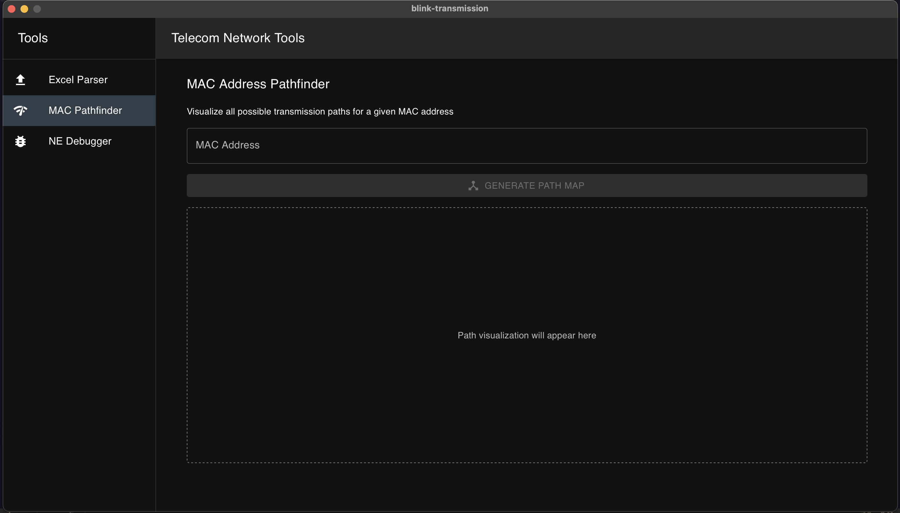

# Telecom Network Tools



## Overview

Telecom Network Tools is a comprehensive desktop application built with Tauri and Rust, designed to assist telecom transmission teams and operations staff with network analysis, debugging, and data transformation tasks. The application provides a unified interface with specialized tools for handling various network management scenarios.

## Features

### Excel Parser
- Upload and parse Excel files containing telecom network data
- Transform spreadsheet data into structured formats
- Batch process multiple files for efficient workflow

### MAC Pathfinder
- Visualize all possible transmission paths for a given MAC address
- Display tower-to-tower connections across 2G, 3G, and 4G infrastructure
- Map complete network equipment paths for specific devices

### NE Debugger
- Analyze Network Element (NE) conditions
- Display met and unmet path conditions for specific network elements
- Assist operations teams with network troubleshooting

## Installation

```bash
# Clone the repository
git clone https://github.com/pesnik/telecom-network-tools.git

# Navigate to the project directory
cd telecom-network-tools

# Install frontend dependencies
npm install

# Run in development mode
npm run tauri dev

# Build the application
npm run tauri build
```

## Development

This application is built using Tauri with a Rust backend and React TypeScript frontend with Material UI components. The project structure follows a hybrid approach:

```
telecom-network-tools/
├── src/                 # Frontend React code
│   ├── components/
│   │   ├── FileUpload.tsx
│   │   ├── ParserButton.tsx
│   │   └── ... other components
│   ├── contexts/
│   │   └── FileContext.tsx
│   ├── App.tsx
│   └── index.tsx
├── src-tauri/           # Rust backend code
│   ├── src/
│   │   ├── main.rs      # Main Rust entry point
│   │   └── ... other Rust modules
│   ├── Cargo.toml       # Rust dependencies
│   └── tauri.conf.json  # Tauri configuration
├── docs/
│   └── ss.png
└── README.md
```

### Adding New Features

To extend the application:

1. **Frontend**: Create new React components in the `src/components` directory
2. **Backend**: Add new Rust functions in the `src-tauri/src` directory
3. **Integration**: Connect frontend and backend using Tauri's invoke system

Example of calling Rust functions from React:
```typescript
import { invoke } from '@tauri-apps/api/tauri';

// Call a Rust function
const result = await invoke('parse_excel_file', { filePath: '/path/to/file.xlsx' });
```

## Contributing

Contributions are welcome! Please feel free to submit a Pull Request.

## Contact

For questions and support, please contact [pesnik](https://github.com/pesnik).

## License

This project is licensed under the MIT License - see the LICENSE file for details.
